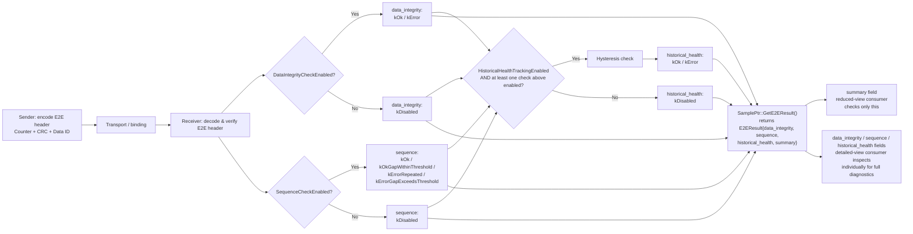

# E2E Error Handling — Requirements & Public API

> **Status:** Finalized proposal for the `mw::com` E2E error-handling public API.
> Covers the requirements (§1) and the accepted design (§2 onward).

## Index

1. [Requirements](#1-requirements)
2. [Overview](#2-overview)
3. [Design rationale](#3-design-rationale)
4. [Deployment-time configuration & states](#4-deployment-time-configuration--states)
5. [Public API reference](#5-public-api-reference)
   - 5.1 [Enums and types](#51-enums-and-types)
   - 5.2 [`SamplePtr<T>` extension](#52-sampleptrt-extension)
6. [Usage examples](#6-usage-examples)
   - 6.1 [Reduced view](#61-reduced-view)
   - 6.2 [Detailed view](#62-detailed-view)
7. [Tradeoffs](#7-tradeoffs)

---

## 1. Requirements

This API is designed to satisfy the following requirements, derived from
how applications actually consume E2E-protected samples across multiple
communication bindings:

| # | Requirement |
|---|---|
| R1 | Expose an E2E result **per sample**. |
| R2 | Provide a **detailed result** (separate per-check status fields) rather than reducing to a single binary outcome — a full-diagnostic view and a simple accept/reject view must both be derivable from the same result. |
| R3 | Correctly categorize every possible check outcome into the exposed status enumeration — no outcome is silently dropped or merged into an unrelated category. |
| R4 | Allow configuring the maximum tolerated sequence gap per deployment. |
| R5 | Never conflate the **warm-up phase** (no prior sample to compare against yet) with a genuine fault — the first sample must not be misreported as an error. |
| R6 | Preserve masquerading/corruption detection (metadata/CRC-based) as a status distinct from sequence-based faults (loss/reorder/repetition). |
| R7 | Stay **binding-agnostic** — the same result model must apply uniformly regardless of the underlying transport/binding, without requiring a separate implementation per binding. |

Additional constraints derived from consumer analysis:

- **Contract, not resolution policy:** this API defines *what status a
  consumer receives per sample*, not a fixed algorithm for what to do with
  a detected fault. Consumers resolve faults differently on purpose
  (discard-and-keep-last-good, escalate to diagnostics, persist for
  forensic analysis, aggregate into a broader health signal) — the API
  must support all of these without imposing one strategy.
- **E2E protection is a deployment-time decision, not a
  runtime-detectable one.** Whether a given consumer performs
  verification is fixed by its configuration; the result accessor must
  always return a concrete value and never require a "not configured"
  sentinel.
- **Historical-health/state tracking is optional, not mandatory** —
  data-integrity/sequence verification must be able to run independently
  of it.
- **Configuration is scoped per consumer, not per producer/event** — the
  same protected data stream can be received by multiple consumers with
  different verification settings (e.g. one consumer with full
  verification, another with verification disabled entirely), and each
  consumer's result reflects only its own configuration.

---

## 2. Overview

Every received sample carries a single `E2EResult` struct with four fields:
`data_integrity`, `sequence`, `historical_health`, and an aggregated
`summary`. `SamplePtr<T>::GetE2EResult()` always returns a concrete value,
because whether E2E protection is active for a given
proxy is a **deployment-time** configuration decision, never something that
needs to be detected at runtime.

**Where this lives in the codebase:** `GetE2EResult()`/`SetE2EResult()` are
an extension to the existing `SamplePtr<T>` type (`ProxyEventBase` is the
only friend allowed to populate the result). No new top-level component is
introduced — a developer receiving samples through a proxy event already has
access to this API without any extra wiring.



## 3. Design rationale

The error classes are kept separate (`data_integrity`, `sequence`,
`historical_health`) so each underlying concept stays easy to reason about;
`summary` is provided purely as a simplification for callers that just want
to know whether a sample is "fine to use".

This separation also matches the wire format itself, not just the API: not
every profile sends a CRC and a sequence counter together — some profiles
carry a CRC without a counter — so `data_integrity` and `sequence` can
correspond to genuinely distinct checks depending on the configured
`E2EProfile`.

## 4. Deployment-time configuration & states

E2E protection is a deployment-time property, not something detectable at
runtime: the wire format carries no flag for it, so header presence/layout
is fixed entirely by the configured `E2EProfile`. Disabling verification
does not remove the header from the wire, so de-/serialization must still
account for it whenever `E2EProfile != None`.

| Configuration | Scope | Meaning |
|---|---|---|
| `E2EProfile` | Sender & receiver | Selects the E2E profile (header layout/length); `None` = no E2E header |
| `DataIntegrityCheckEnabled` | Receiver only | Enables the check producing `data_integrity`; `false` → `kDisabled` |
| `SequenceCheckEnabled` | Receiver only | Enables the check producing `sequence`; `false` → `kDisabled` |
| `HistoricalHealthTrackingEnabled` | Receiver only | Enables the hysteresis check producing `historical_health`; `false` → `kDisabled` |

`DataIntegrityCheckEnabled` and `SequenceCheckEnabled` are independent
knobs, not a combined one, since not every profile carries a CRC and a
counter together.

**Defaults & misconfiguration:**

- `E2EProfile == None` defaults all three to `false`; any other profile
  defaults all three to `true` (each independently overridable).
- Enabling `DataIntegrityCheckEnabled`/`SequenceCheckEnabled` without a
  profile, or enabling `HistoricalHealthTrackingEnabled` while both other
  checks are off, is a misconfiguration.
- Misconfigurations are rejected at load time — startup fails fast with a
  clear error, so `GetE2EResult()` never has to handle an invalid
  configuration at runtime.

**Deployment states:**

| Case | `data_integrity` | `sequence` | `historical_health` | `summary` | Action |
|---|---|---|---|---|---|
| Both checks + historical health enabled | computed | computed | computed | `kOk` / `kError` | Accept only if `summary == kOk` |
| Both checks enabled, historical health disabled | computed | computed | `kDisabled` | `kOkWithDisabledChecks` / `kError` | Decide from `data_integrity`/`sequence` |
| Only data-integrity + historical health enabled | computed | `kDisabled` | computed (from `data_integrity` only) | `kOkWithDisabledChecks` / `kError` | Decide from `data_integrity`/`historical_health` |
| Only data-integrity enabled | computed | `kDisabled` | `kDisabled` | `kOkWithDisabledChecks` / `kError` | Decide from `data_integrity` alone |
| Only sequence + historical health enabled | `kDisabled` | computed | computed (from `sequence` only) | `kOkWithDisabledChecks` / `kError` | Decide from `sequence`/`historical_health` |
| Only sequence enabled | `kDisabled` | computed | `kDisabled` | `kOkWithDisabledChecks` / `kError` | Decide from `sequence` alone |
| Both checks disabled (profile configured or not) | `kDisabled` | `kDisabled` | `kDisabled` | `kDisabled` | Application-specific — no verification ran; not the same as "safe to use" |
| Misconfiguration (check enabled without a profile, or historical health enabled with no source check) | — | — | — | — | Rejected at load time — service does not start |

The "both checks disabled" case looks identical to the consumer whether or
not a profile is configured, but differs on the wire: with a profile, an
E2E header is still present and must be skipped during deserialization;
without one, there never was a header.

## 5. Public API reference

### 5.1 Enums and types

```cpp
enum class DataIntegrityStatus {
    kDisabled, // Check disabled
    kOk,       // Metadata and CRC match expectations
    kError,    // Metadata or CRC mismatch
};

enum class SequenceStatus {
    kDisabled,                 // Check disabled
    kOk,                       // No loss (or first message received)
    kOkGapWithinThreshold,     // Gap within allowed threshold
    kErrorRepeated,            // Repeated message
    kErrorGapExceedsThreshold, // Gap exceeds allowed threshold
};

enum class HistoricalHealthStatus {
    kDisabled, // Check disabled
    kOk,       // Error counter at/below recovery threshold
    kError,    // Error counter at/above error threshold (hysteresis applies)
};

enum class Summary {
    kDisabled,             // No checks ran
    kOk,                   // All enabled checks passed, none disabled
    kOkWithDisabledChecks, // Enabled checks passed, but some were disabled
    kError,                // At least one check failed
};

struct E2EResult {
    DataIntegrityStatus data_integrity;
    SequenceStatus sequence;
    HistoricalHealthStatus historical_health;
    Summary summary;
};
```

### 5.2 `SamplePtr<T>` extension

```cpp
template <typename T>
class SamplePtr final {
  public:
    /// Always returns a concrete value — E2E protection is a
    /// deployment-time decision, see §4. Each field reports `kDisabled` when its
    /// underlying check wasn't enabled for this deployment.
    E2EResult GetE2EResult() const { return e2e_result_; }
  private:
    friend class ProxyEventBase;
    void SetE2EResult(E2EResult result) { e2e_result_ = result; }
    E2EResult e2e_result_;
};
```

## 6. Usage examples

### 6.1 Reduced view

Most simple consumers only ever look at `summary` — a single field is
enough to decide accept/reject:

```cpp
void SimpleConsumer::OnSampleReceived(SamplePtr sample) {
    const auto e2e_result = sample->GetE2EResult();  // always present

    if (e2e_result.summary == Summary::kOk) {
        process_sample(*sample);  // Accept — safe to use
    } else if (e2e_result.summary == Summary::kOkWithDisabledChecks ||
               e2e_result.summary == Summary::kDisabled) {
        // Some or all checks didn't run — accepting is an application-specific policy,
        // not something the API decides on the consumer's behalf.
        log_info("E2E partial/no verification for this sample");
        process_sample(*sample);  // Accept — application's own policy
    } else {
        log_error("E2E status not safe: data_integrity=" + to_string(e2e_result.data_integrity) +
                  ", sequence=" + to_string(e2e_result.sequence) +
                  ", historical_health=" + to_string(e2e_result.historical_health));
        // REJECT
    }
}
```

### 6.2 Detailed view

Some consumers need the full, undiluted status per sample instead of a
reduced accept/reject decision — e.g. persisting E2E status alongside every
recorded sample for later forensic/offline analysis:

```cpp
void DiagnosticConsumer::OnSampleReceived(SamplePtr sample) {
    const auto e2e_result = sample->GetE2EResult();  // always present

    // Persist every field regardless of summary — nothing is discarded.
    persist_sample_with_metadata(*sample, e2e_result);

    if (e2e_result.summary == Summary::kError) {
        log_warn("Recorded sample failed E2E verification");
    }
}
```

## 7. Tradeoffs

- ✅ Single accessor, all info in one struct → simpler caller logic
- ✅ Detailed fields (`data_integrity`/`sequence`/`historical_health`)
  always accessible, plus an aggregated `summary` for simple consumers
- ✅ `GetE2EResult()` always returns a concrete value — E2E is a
  deployment-time decision (see §4)